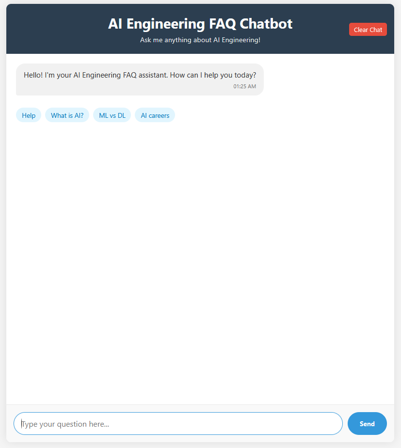
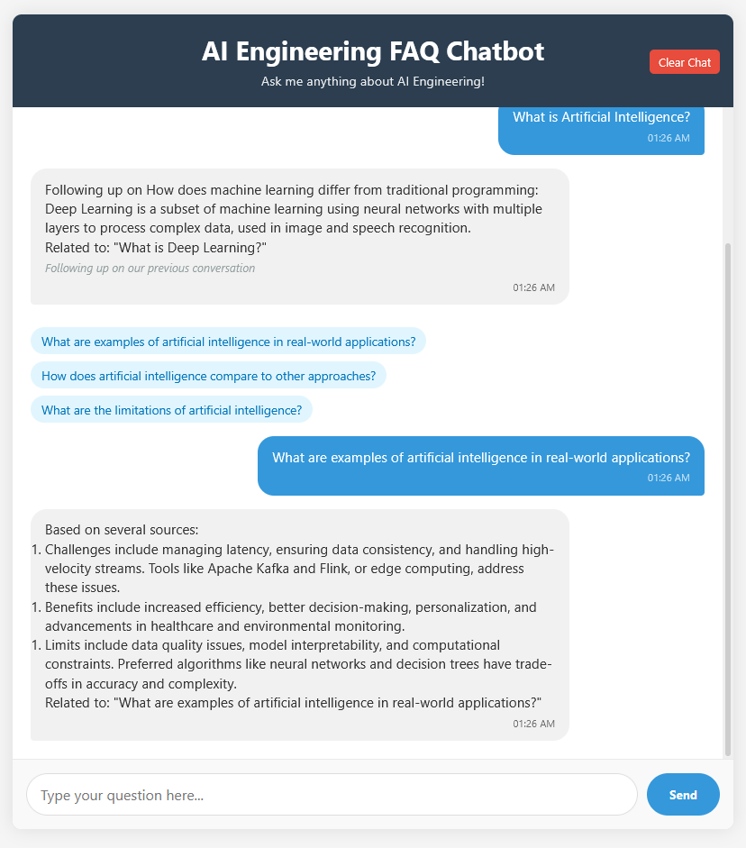

# AI Engineering FAQ Chatbot

An intelligent chatbot application that answers questions about AI Engineering using advanced Natural Language Processing techniques, featuring context-awareness and multi-source answer composition.



## Features

- **Advanced NLP Processing**: Utilizes SpaCy for sophisticated text analysis with intelligent fallback mechanisms
- **Semantic Question Matching**: Implements vector similarity (SpaCy) and enhanced TF-IDF for question matching
- **Intent Recognition**: Identifies question types (definitions, comparisons, how-to, etc.) for more accurate responses
- **Context-Aware Conversations**: Maintains conversation history to properly handle follow-up questions
- **Entity Recognition**: Extracts key AI engineering concepts to enhance matching and response generation
- **Multi-Source Answer Composition**: Combines information from multiple FAQs for complex questions
- **Intelligent Fallbacks**: Provides helpful responses even when no exact match is found
- **Responsive UI**: Clean interface with typing indicators, formatted responses, and suggestion chips

## System Architecture

This chatbot implements a sophisticated architecture with multiple components:

1. **Knowledge Base**: A structured collection of AI Engineering FAQs in JSON format
2. **Natural Language Processing**: Advanced text analysis using SpaCy or a robust fallback system
3. **Question Matching**: Semantic similarity using vectors or enhanced TF-IDF with custom boosting
4. **Intent Recognition**: Pattern-based detection of question types and conversation context
5. **Web Interface**: Responsive UI with real-time interaction and message formatting

## Prerequisites

- Python 3.7+ installed
- pip package manager
- For optimal performance: Microsoft Visual C++ Build Tools (for SpaCy)
- Web browser with JavaScript enabled

## Recommended Workflow

This chatbot uses a three-step setup process for maximum flexibility and reliability:

1. **Environment Setup**: Run `setup_and_run.bat` to set up the environment and install dependencies
2. **SpaCy Configuration**: Activate the environment and run `spacy_setup.py` to configure SpaCy
3. **Application Launch**: Run `app.py` to start the chatbot application

This separation ensures that basic functionality is available even if advanced NLP features encounter issues.



## Installation & Running

### Complete Setup Process

Here's the recommended way to set up and run the chatbot:

1. Run the `setup_and_run.bat` script to set up the environment
   - This creates a Python virtual environment
   - Installs all required dependencies (Flask, NumPy, scikit-learn, SpaCy, etc.)

2. Manually activate the virtual environment:

   ```powershell
   venv\Scripts\activate
   ```

3. Configure your preferred SpaCy language model:

   ```powershell
   python spacy_setup.py
   ```

   - You'll be prompted to select a model:
     - Small model (~12MB): Faster but less accurate
     - Medium model (~40MB): Good balance of size and capability
     - Large model (~560MB): Best accuracy but largest download
   - The script saves your choice to `config.json` for future use

4. Run the application:

   ```powershell
   python app.py
   ```

5. Open a web browser and navigate to: `http://localhost:5000`

For subsequent uses, you only need to activate the environment and run the application (steps 2, 4, and 5).

## Manual Installation

If you prefer to install without the batch script:

1. Create a virtual environment:

   ```powershell
   python -m venv venv
   ```

2. Activate the virtual environment:

   ```powershell
   venv\Scripts\activate
   ```

3. Install dependencies:

   ```powershell
   pip install -r requirements.txt
   ```

4. Configure a SpaCy model:

   ```powershell
   python spacy_setup.py
   ```

5. Run the application:

   ```powershell
   python app.py
   ```

## Troubleshooting

### SpaCy Installation Issues

If you encounter errors installing SpaCy:

1. **Microsoft Visual C++ Build Tools:** SpaCy requires C++ compilation. Install the [Microsoft C++ Build Tools](https://visualstudio.microsoft.com/visual-cpp-build-tools/)
2. **Don't worry:** The application has a fallback mode that works without SpaCy

### Python Version Compatibility

- This application works best with Python 3.8-3.10
- If using newer versions (3.11+), you may need to install pre-compiled wheels

### Other Issues

- Check your Python installation is working: `python --version`
- Verify pip is installed: `pip --version`
- Make sure you're running commands from the project directory

## Quick Start (After Initial Setup)

1. Activate the virtual environment:

   ```powershell
   venv\Scripts\activate
   ```

2. Start the Flask server:

   ```powershell
   python app.py
   ```

3. Open a web browser and go to: `http://localhost:5000`
4. Start asking questions about AI Engineering!

## How It Works

1. **Adaptive NLP Processing**: The application processes natural language using:
   - **SpaCy Integration**: When installed, the system leverages the selected SpaCy model (small/medium/large)
   - **Custom TF-IDF Fallback**: When SpaCy is unavailable, a robust TF-IDF algorithm handles text processing
   - **Model Configuration**: The `spacy_setup.py` script manages SpaCy model selection and installation
   - **Configuration Persistence**: Model choices are stored in `config.json` for future sessions

2. **Question Analysis & Matching**:
   - **Vector Similarity**: With SpaCy enabled, the system compares question vectors for semantic similarity
   - **TF-IDF Matching**: The fallback system uses TF-IDF vectors with custom weighting
   - **Knowledge Base Search**: Questions are matched against the structured data in `faqs.json`
   - **Answer Ranking**: Results are sorted by confidence score with a minimum threshold filter

3. **Web Interface & Interaction**:
   - **Flask Backend**: Handles HTTP requests and serves the web application
   - **AJAX Communication**: Asynchronous JavaScript updates the interface without page reloads
   - **Response Formatting**: Messages are properly formatted with markdown-like syntax
   - **Chat History**: User and system messages are displayed in a scrollable conversation view

## Project Structure

### Core Components

- `app.py`: Main application with Flask server, NLP processing, and conversation management
- `faqs.json`: Structured knowledge base containing AI Engineering question-answer pairs
- `config.json`: Configuration file storing the selected SpaCy model (created during setup)

### Setup & Configuration

- `setup_and_run.bat`: Environment setup script that creates virtualenv and installs dependencies
- `spacy_setup.py`: Interactive utility for SpaCy model selection and installation
- `requirements.txt`: List of Python dependencies including Flask, scikit-learn, and SpaCy

### Web Interface

- `templates/index.html`: HTML template for the responsive chat interface
- `static/style.css`: CSS styling with animations, message formatting, and responsive design
- `static/script.js`: Client-side JavaScript for UI interactions and conversation management

### Documentation

- `README.md`: User guide with setup instructions and feature overview
- `TECHNICAL_DOCS.md`: Technical documentation of system architecture and implementation

## Advanced Features

### Conversation Context Management

The chatbot remembers previous interactions and maintains context, allowing for natural follow-up questions without repeating information.

### Intent Recognition

The system identifies the intent behind questions (definitions, comparisons, how-to, etc.) to provide more relevant answers.

### Multi-source Answer Generation

For complex questions, the system can combine information from multiple FAQs to create comprehensive answers.

### Suggestion Chips

After answering a question, the chatbot provides suggestion chips for related topics and follow-up questions to guide the conversation.

### Graceful Degradation

The system automatically detects available capabilities and provides the best possible experience regardless of dependencies.
